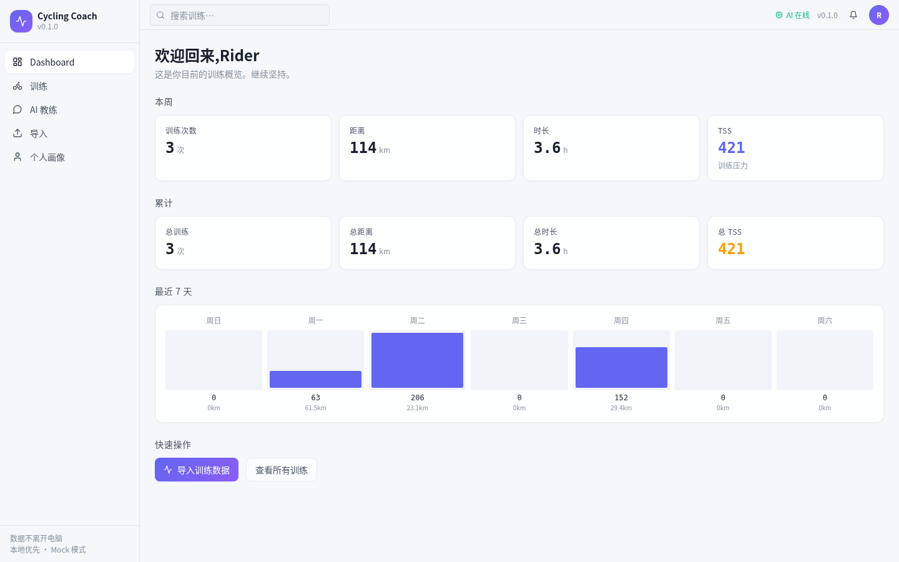
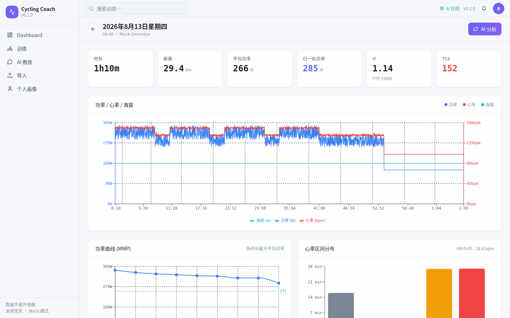
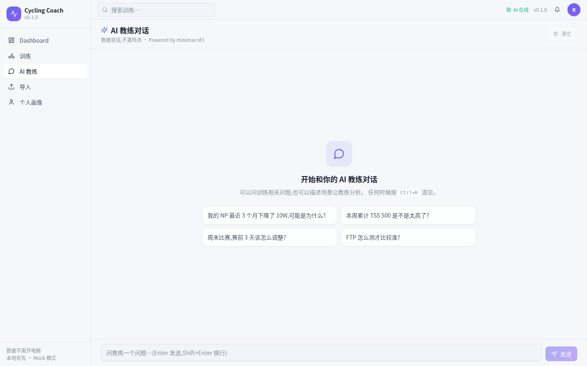
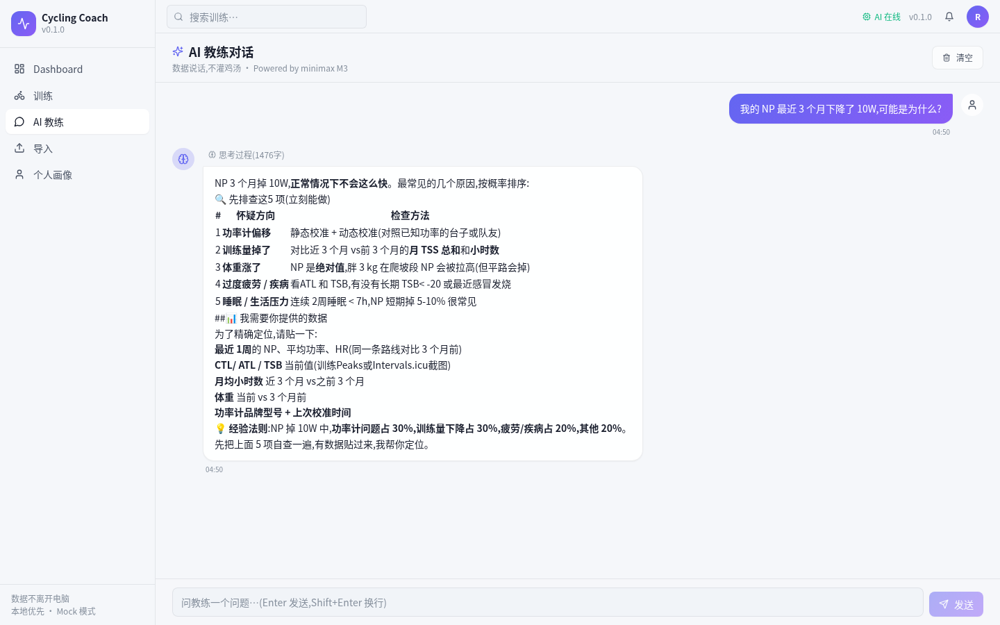

# 公路自行车 AI 教练 · Cycling Coach

> 把公路车训练从"经验"升级为"数据 + 智能"。


## 项目愿景

公路车训练的痛点:
- 训练数据散落在码表 / 心率带 / 功率计里,没人帮你整合
- 主流码表(TP / Garmin)的算法黑盒,无法定制
- 缺乏专业的"翻译"——数据怎么变成改进建议

Cycling Coach 想做的是:**一个跑在你电脑上的 AI 教练**,把 FIT 数据自动解读成可执行建议。

## v0.1.0 — 已实现

### 后端 (Python + FastAPI)
- [x] **FIT 文件解析** — `fitparse` + 1Hz 样本入库
- [x] **核心指标计算**(NP / IF / TSS / EF / VI / W'bal / 功率曲线 MMP / HR 区间 / 漂移 / 踏频区间)
- [x] **AI 教练** — OpenRouter 兼容协议(minimax M3 + m2.7 fallback)
  - 支持 reasoning model(`delta.reasoning` 抽取思考过程)
  - 5 类错误分类(401 / 402 / 5xx / 网络 / 解析)
- [x] **多场景 prompt** — 解读训练 / 自由对话(教练风格统一)
- [x] **流式响应** — SSE,前端实时渲染
- [x] **本地数据库** — SQLite + SQLAlchemy 2.0(数据不离开电脑)
- [x] **个体画像** — FTP / max_hr / lthr / 体重等核心字段
- [x] **5 个 REST 模块** — activities / athlete / dashboard / dev(mock) / coach
- [x] **冒烟测试** — `scripts/smoke_test.py` 端到端跑通

### 前端 (React + Vite + Tailwind)
- [x] **6 个页面** — Dashboard / 训练列表 / 训练详情 / 导入 / 个人画像 / **AI 教练对话**
- [x] **5 类图表** — 功率曲线 / 心率区间 / 功率-心率-海拔时间图 / 周柱状 / 表格
- [x] **AI 教练对话** — 用户/AI 气泡、SSE 流式、停止按钮、思考过程折叠、Markdown 渲染
- [x] **5 个 Mock 训练模板** — 无 FIT 文件也能完整体验

### 工程
- [x] **跨平台一键启动** — Windows `.bat` + macOS/Linux `.sh`(沙盒内验证通过)
- [x] **GBK 编码兼容** — Windows 启动器自动 UTF-8,无解码错误
- [x] **直接调 `node_modules/.bin/vite`** — 避免 pnpm + 中文路径兼容性坑

## 30 秒上手

Windows:解压后双击 `启动.bat`,等 1-2 分钟,看到「应用已就绪」后浏览器开 `http://localhost:1420`。

macOS / Linux:
```bash
chmod +x start.sh
./start.sh
```

启动脚本会自动装 Python venv + Node 依赖、配 pip / npm 镜像源、起后端 + 前端。

停止:`停止.bat` 或 `./stop.sh`

## 第一次体验流程

1. 打开 `http://localhost:1420`
2. 进入「导入」页面
3. 点「Z2 长距离 90min」生成一个模拟活动
4. 自动跳到「训练详情」,看到:
   - 功率 / 心率 / 海拔 实时图
   - 功率曲线 (MMP)
   - HR 区间分布
   - AI 教练报告(点击「AI 分析」生成)
5. 切到「AI 教练」直接对话(支持 minimax M3,带推理过程)
6. 「Dashboard」看整体训练负荷
7. 「个人画像」调整你的 FTP / 最大心率

## 架构

```
┌──────────────────────────────────────────────────────┐
│         React 前端 (Vite :1420)                      │
│   Dashboard · 训练 · 训练详情 · AI教练 · 导入 · 画像│
│   苹果毛玻璃风格 · 实时图表 · SSE 流式对话            │
└────────────────────┬─────────────────────────────────┘
                     │ HTTP (Vite 代理)
                     ▼
┌──────────────────────────────────────────────────────┐
│        Python Sidecar (FastAPI :8765)                │
│   FIT 解析 → 指标计算 → 个体画像 → AI 教练 Agent    │
│   SSE 流式 chat · Mock 数据生成器                    │
└────────────────────┬─────────────────────────────────┘
                     │ HTTPS
                     ▼
              minimax M3 / OpenAI 兼容 LLM
            (Mock 模式无需 key,本地直接跑)
```

## 技术栈

| 层 | 技术 |
|---|---|
| 前端 | React 18 + Vite 5 + TypeScript + Tailwind 3 + Recharts + Zustand + react-markdown |
| 后端 | Python 3.11+ + FastAPI + uvicorn |
| 数据 | SQLite + SQLAlchemy 2.0 |
| FIT 解析 | fitparse |
| 指标 | NumPy / SciPy / Pandas |
| LLM | minimax M3 / OpenAI 兼容协议 / Mock 兜底 |

## 目录结构

```
cycling-coach/
├── 启动.bat / 启动.sh / 停止.bat / 停止.sh
├── start.py / stop.py / diagnose.py
├── .env.example                            # 模板(不含 key)
│
├── backend/                                # Python FastAPI Sidecar
│   ├── main.py                              # FastAPI 入口 + lifespan
│   ├── core/                                # config / logging
│   ├── parsers/                             # FIT → 标准化 Activity
│   ├── metrics/                             # 功率 / 心率 / 曲线计算
│   ├── profile/                             # 个体画像
│   ├── db/                                  # SQLAlchemy ORM
│   ├── routers/                             # 5 个 REST 路由
│   ├── coach/                               # AI 教练 Agent
│   │   ├── m3_client.py                     # OpenRouter 客户端 + reasoning model 支持
│   │   ├── orchestrator.py                  # SSE 流式编排
│   │   ├── tools/                           # 工具注册
│   │   └── prompts/                         # 风格 + 场景 prompt
│   └── reports/                             # 报告生成(预留)
│
├── frontend/                               # React + Vite
│   ├── src/
│   │   ├── App.tsx
│   │   ├── pages/  (6 个页面)
│   │   ├── components/  (7 个组件,含 ChatMessage)
│   │   ├── lib/  (api + types)
│   │   ├── store/  (Zustand)
│   │   └── styles/index.css                 # 苹果毛玻璃基础类
│   ├── tailwind.config.js                   # 浅色主题
│   └── package.json
│
├── scripts/
│   ├── smoke_test.py                        # 端到端冒烟测试
│   └── screenshot.mjs                       # 截图工具(开发用)
│
├── assets/screenshots/                      # README 截图
│
├── workspace/                               # 运行时数据(gitignore)
│   ├── input/  /  output/
│   └── .gitkeep
│
└── docs/
    ├── PLAN.md                              # 项目规划
    └── ARCHITECTURE.md                     # 架构文档(预留)
```

## 数据模型

```sql
athletes     -- 运动员(单用户 MVP)
  id, name, ftp, ftp_estimated, max_hr, lthr, weight_kg, height_cm

activities   -- 训练记录
  id, athlete_id, source, start_time, duration_s, distance_m,
  avg_power, max_power, avg_hr, max_hr, avg_cadence,
  metrics (JSON: NP/IF/TSS/EF/VI/MMP/HR_zones/...),
  samples_json (1Hz 1 小时内的样本),
  laps_json, report, report_status

workouts     -- AI 生成的训练课程(V0.2+)
preferences  -- KV 偏好
```

## Mock 模式

不配 `M3_API_KEY` 时,**所有 AI 调用自动走 mock 兜底**,返回一个基于真实指标的"假但合理"报告。

要在生产环境用真实 AI,在 `.env` 填入:
```ini
M3_API_KEY=sk-or-v1-...
M3_BASE_URL=https://openrouter.ai/api/v1
M3_MODEL=minimax/minimax-m3
```


## 常见问题

### 启动后访问 127.0.0.1:1420 白屏

检查启动 cmd 有没有报错:
- 后端是否 `Application startup complete`
- 前端是否 `Local: http://127.0.0.1:1420/`

### 上传 FIT 失败

V0.1.0 只支持 `.fit` 文件,其他格式(`.tcx` / `.csv`)留 V1.0。

### 端口 8765 / 1420 被占用

Windows:
```cmd
netstat -ano | findstr :8765
taskkill /F /PID <pid>
```
macOS / Linux:
```bash
lsof -i :8765
kill -9 <pid>
```

或者直接 `停止.bat` / `./stop.sh` 清理。

## 截图

| Dashboard | 训练详情 |
|---|---|
|  |  |
| **AI 教练** | **对话** |
|  |  |

## 致谢

- 数据格式:Garmin FIT SDK

